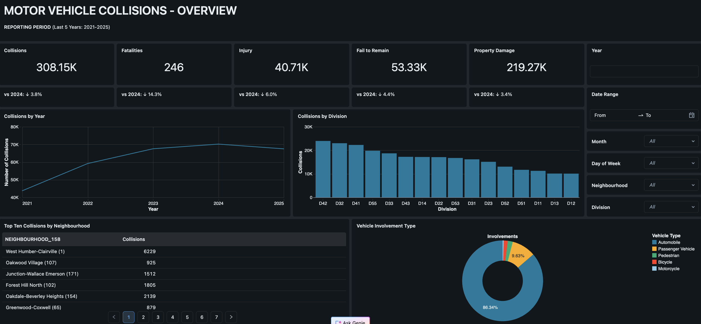
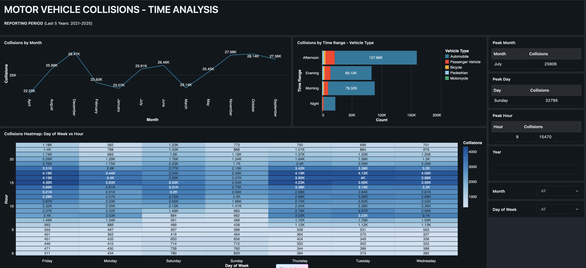
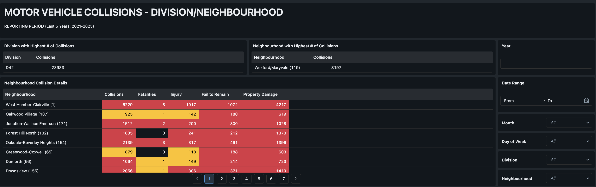

# 🚦 Toronto Motor Vehicle Collision Analysis (2021–2025)

## 📌 Project Overview

This project analyzes **5 years of motor vehicle collision data (2021–2025)** across Toronto neighbourhoods and police divisions. Using Databricks as the analytics platform, the analysis uncovers patterns in collision frequency, timing, geography, and vehicle involvement to support data-driven road safety decisions.

**Data Source:** [City of Toronto Open Data Portal](https://open.toronto.ca/)

---

## 📊 Dashboards

## 🔗 Live Dashboard
👉 [Click here to view the interactive dashboard](https://dbc-ed1d02d7-f760.cloud.databricks.com/dashboardsv3/01f138fc1cc91c03bb14f652bbe18871/published?o=7474650509418187)

### 1. Overview Dashboard

Key citywide metrics at a glance with year-over-year comparisons and breakdowns by division, neighbourhood, and vehicle type.

### 2. Time Analysis Dashboard

Collision patterns across months, days of the week, hours of the day, and time ranges — with vehicle type breakdown.

### 3. Division & Neighbourhood Dashboard

Granular breakdown of collisions, fatalities, injuries, fail-to-remain incidents, and property damage by neighbourhood.

---

## 🔑 Key Findings

### 📍 Geography
- **Division D42** recorded the highest collision count with **23,983 incidents** over 5 years
- **West Humber-Clairville (1)** was the highest-collision neighbourhood with **6,229 incidents**
- **Wexford/Maryvale (119)** had the highest collision density at **8,197 incidents**

### ⏰ Time Patterns
- **Afternoon** is the most dangerous time of day with **137.88K collisions** — nearly double the evening period
- **July** is the peak collision month with **25,906 incidents**
- **Sunday** is the peak day with **32,795 collisions**
- **9 AM** is the single highest collision hour with **15,470 incidents**

### 🚗 Vehicle Involvement
- **Automobiles** account for **86.34%** of all vehicle involvements
- **Passenger vehicles** make up **9.63%** of involvements
- Cyclists and motorcyclists represent a smaller but notable share

### 📉 Year-over-Year Trends (vs 2024)
| Metric | Change |
|--------|--------|
| Total Collisions (308.15K) | ↓ 3.8% |
| Fatalities (246) | ↓ 14.3% |
| Injuries (40.71K) | ↓ 6.0% |
| Fail to Remain (53.33K) | ↓ 4.4% |
| Property Damage (219.27K) | ↓ 3.4% |

---

## 🛠️ Tools & Technologies

| Tool | Purpose |
|------|---------|
| **Databricks** | Data processing, SQL queries, workspace environment |
| **Python (PySpark / Pandas)** | Data cleaning and transformation |
| **SQL** | Data extraction and aggregation |
| **Power BI** | Dashboard creation and KPI visualization |
| **Excel** | Supporting data validation |

## 💡 Recommendations

Based on the findings, road safety interventions should prioritize:

1. **Afternoon hours (12 PM – 6 PM)** — highest collision window, especially on Sundays
2. **Division D42 and West Humber-Clairville** — highest-risk geographic zones
3. **9 AM commuter hour** — targeted enforcement or infrastructure review
4. **July and November** — seasonal peaks warrant proactive safety campaigns

---

## 👤 Author

**Saksham Jain**
Data Analyst | Sheridan College, Computer Programming
[LinkedIn](www.linkedin.com/in/saksham-jains) · [GitHub](https://github.com/saksham1214)
